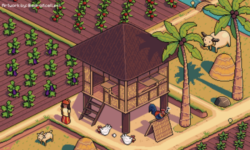

# BarrioRun



BarrioRun is a Filipino-themed 2D endless runner written in Java with Swing and Java2D. The player runs through a rural Philippine *barrio*, jumping or ducking past chickens and carabaos while the scenery scrolls, the pace increases, and the local high-score table records the best runs.

The project is a self-contained Eclipse Java project. It uses only APIs included with the JDK—Swing/AWT for the interface and rendering, Java Sound for audio, and standard file I/O for score persistence. No external libraries or build framework are required.

## Table of contents

- [Features](#features)
- [Gameplay](#gameplay)
- [Application flow](#application-flow)
- [Architecture](#architecture)
- [Object-oriented design](#object-oriented-design)
- [Game loop and rendering](#game-loop-and-rendering)
- [Collision, scoring, and difficulty](#collision-scoring-and-difficulty)
- [Resources, audio, and persistence](#resources-audio-and-persistence)
- [Project structure](#project-structure)
- [Getting started](#getting-started)
- [Development notes](#development-notes)
- [Ideas for future work](#ideas-for-future-work)
- [Credits](#credits)
- [License](#license)

## Features

- Filipino rural-village theme with custom pixel artwork, fonts, music, and sound effects
- Endless-runner gameplay with jumping and ducking
- Two randomized obstacle types: chicken and carabao
- Increasing movement speed and obstacle frequency as the score grows
- Animated running and ducking sprites
- Recycled ground tiles and parallax-style clouds for continuous scrolling
- Three-position local scoreboard stored between sessions
- Player-name entry and in-game name editing
- Splash, menu, instructions, settings, scoreboard, about, gameplay, and game-over screens
- Retry, return-to-menu, and quit actions after each run

## Gameplay

The character runs automatically. The objective is to survive for as long as possible by avoiding every obstacle. There is no health system: one collision ends the current run.

### Controls

| Key | Context | Action |
| --- | --- | --- |
| `Space` | Start screen | Begin the run |
| `Space` | During a run | Jump, if the character is on the ground |
| `Down Arrow` | During a run | Duck while the key is held |

Jumping applies an initial vertical velocity of `-9` and gravity of `0.4` per update. A new jump is accepted only after the character has returned to the ground. Ducking changes both the displayed animation and the collision box.

### Scoring

- Passing an obstacle awards **20 points**.
- A score sound plays whenever the score reaches a multiple of **500**.
- At game over, the result is compared with the saved top three scores.
- Scores are ranked from highest to lowest and stored with the player name.

### Difficulty progression

Difficulty is derived from the score rather than selected from a menu.

| Score | Movement speed | Random obstacle-spawn interval |
| --- | ---: | ---: |
| `0–199` | 3 pixels/update | 100–999 update ticks |
| `200–999` | 5 pixels/update | 50–799 update ticks |
| `1000+` | 7 pixels/update | 35–124 update ticks |

The game loop targets 100 updates/frames per second, so higher tiers move the world faster and can create obstacles more frequently.

## Application flow

```text
SplashScreen
    |
    v
NameHandler ---- captures the current player name
    |
    v
MainScreen
    |-- New Game --> instructions2 --> GameWindow --> GameScreen
    |                                              |
    |                                              v
    |                                          GameOver
    |                                      /       |       \
    |                                  Retry     Back      Quit
    |                                    |         |
    |                                    v         v
    |                                GameWindow  MainScreen
    |
    |-- Scoreboard --> ScoreBoard
    |-- Instructions -> Instructions
    |-- Settings ----> Settings
    |-- About -------> AboutUs
    `-- Quit
```

`SplashScreen` is the intended application entry point. It presents the loading screen and start sound before opening `NameHandler`. After the name is entered, `MainScreen` becomes the navigation hub. Starting a new game shows the instructions and then creates a `GameWindow` containing the live `GameScreen`.

When a collision occurs, `GameScreen` stops the gameplay music, records the final score through `ScoreBoard`, opens `GameOver`, and closes the game window. The player can immediately retry, return to the menu, or quit.

## Architecture

The source is organized into three packages with distinct responsibilities.

### `gui` — presentation and application flow

| Class | Responsibility |
| --- | --- |
| `SplashScreen` | Shows startup artwork, progress feedback, and the startup sound. |
| `NameHandler` | Collects and retains the current player name. |
| `MainScreen` | Main menu and navigation to the other screens. |
| `Instructions` | Instructions screen opened from the menu. |
| `instructions2` | Pre-game instructions and the transition into gameplay. |
| `GameWindow` | Top-level frame that owns and starts `GameScreen`. |
| `GameScreen` | Core game controller, state machine, update loop, rendering, and keyboard input. |
| `GameOver` | Displays the final score and offers retry, back, and quit actions. |
| `ScoreBoard` | Loads, ranks, displays, and saves the top three scores. |
| `Settings` | Clears saved scores or changes the current player name. |
| `AboutUs` | Describes the game and its creators. |
| `FontLoader` | Loads the custom fonts used by the Swing screens. |
| `StyledButtonUI` | Custom rounded Swing button painting and pressed-state offset. |

### `pojo` — game-world model

| Class | Responsibility |
| --- | --- |
| `MainCharacter` | Player position, movement, animation state, collision bounds, score, and jump/score audio. |
| `Enemy` | Abstract contract shared by obstacle types. |
| `Obstacles` | Concrete moving obstacle with its sprite and collision rectangle. |
| `EnemiesManager` | Creates randomized obstacles, updates and removes them, awards points, and detects collisions. |
| `Land` | Builds and recycles randomized ground tiles to create continuous motion. |
| `Clouds` | Moves and recycles background clouds and draws the hut scenery. |

### `util` — reusable support code

| Class | Responsibility |
| --- | --- |
| `Animation` | Stores animation frames and advances them using a millisecond frame duration. |
| `Resource` | Loads image files into `BufferedImage` objects. |

### Main object relationships

```text
GameWindow
  `-- owns GameScreen
        |-- owns MainCharacter
        |-- owns Land ------------------ uses MainCharacter speed
        |-- owns Clouds ---------------- uses MainCharacter speed
        `-- owns EnemiesManager -------- uses MainCharacter
                  `-- manages List<Obstacles>
                            `-- extends Enemy

MainCharacter
  `-- composes Animation objects for running and ducking

GameOver
  `-- uses ScoreBoard to persist the completed run
```

`GameScreen` acts as the central coordinator. It does not implement every world behavior itself: it delegates character physics to `MainCharacter`, obstacle lifecycle and collision queries to `EnemiesManager`, terrain movement to `Land`, and background movement to `Clouds`.

## Object-oriented design

### Encapsulation

Each class keeps its state close to the behavior that changes it. For example, `MainCharacter` owns its position, velocity, animation state, collision rectangle, and sound clips. Callers use operations such as `jump()`, `down(...)`, `dead(...)`, `update()`, and `getBound()` instead of directly implementing those behaviors in the UI.

`Animation` similarly hides frame timing and indexing behind `addFrame(...)`, `updateFrame()`, and `getFrame()`.

### Abstraction

`Enemy` defines the operations required by any object that behaves like an obstacle:

```java
public abstract void update();
public abstract void draw(Graphics g);
public abstract Rectangle getBound();
public abstract boolean isOutOfScreen();
```

This lets `EnemiesManager` work with the concept of an enemy without depending on the concrete drawing or movement details.

### Inheritance

`Obstacles` extends `Enemy` and supplies concrete implementations for movement, rendering, collision bounds, and off-screen detection. The Swing screens also inherit from `JFrame`, `GameScreen` inherits from `JPanel`, and `StyledButtonUI` extends `BasicButtonUI` to customize standard button behavior.

### Polymorphism

`EnemiesManager` iterates over `Enemy` references and invokes `update()`, `draw(...)`, `getBound()`, and `isOutOfScreen()` polymorphically. Additional enemy subclasses can therefore be introduced without rewriting the manager's main update and collision loops.

### Composition and delegation

The game favors composition for its runtime structure. `GameScreen` is assembled from a character, obstacle manager, terrain, and background layer. `MainCharacter` contains animation objects instead of inheriting animation logic, while managers delegate image loading to `Resource`.

### Singleton-style shared player state

`NameHandler.getInstance()` lazily creates one shared name-entry window. Its static player-name value is then read by the menu and game-over screens. This is a small-scale singleton-style approach for sharing the current player's identity across separately created Swing frames.

### State-driven behavior

Two lightweight state machines control the experience:

- `GameScreen`: `START_GAME_STATE`, `GAME_PLAYING_STATE`, and `GAME_OVER_STATE`
- `MainCharacter`: `NORMAL_RUN`, `JUMPING`, `DOWN_RUN`, and `DEATH`

Input, updates, collision bounds, rendering, and transitions change according to the active state. These are state-pattern concepts implemented with constants and `switch` statements rather than separate state classes.

### Event-driven programming

Swing `ActionListener` instances handle menu and button actions, while `GameScreen` implements `KeyListener` for real-time keyboard input. The gameplay loop implements `Runnable` and runs on its own thread, separate from the event listeners that drive the surrounding UI.

## Game loop and rendering

`GameScreen.run()` targets 100 frames per second. Every iteration performs the following sequence:

1. Update the game only when the state is `GAME_PLAYING_STATE`.
2. Recalculate speed from the current score.
3. Update clouds, land, the main character, and all obstacles.
4. Test for a character/obstacle collision.
5. Request a Swing repaint.
6. Sleep for the remainder of the target frame time.

Rendering uses Java2D through Swing's `Graphics` object. The background is drawn first, followed by clouds, terrain, obstacles, the player, and finally the score. Ground tiles that leave the screen are moved to the end of the tile list and assigned a randomized texture. Clouds move at one-eighth of the player's horizontal game speed, producing a simple parallax effect.

The player animation is time-based rather than frame-count-based. The running and ducking animations each alternate between two images every 90 milliseconds; jumping and death use single images.

## Collision, scoring, and difficulty

Both the character and every obstacle expose an axis-aligned `Rectangle` through `getBound()`. `EnemiesManager.isCollision()` tests those rectangles with `Rectangle.intersects(...)`.

The player's rectangle is adjusted when ducking so the collision area follows the lower pose. Obstacle rectangles are slightly inset from their source image dimensions. This reduces collisions caused only by transparent padding around a sprite.

Obstacles move left by the current horizontal speed. Once the first obstacle has moved completely beyond the left edge, the manager removes it and calls `MainCharacter.upScore()`. Speed and spawn ranges are recalculated continuously from the updated score, so progression happens during a run without restarting the game.

## Resources, audio, and persistence

### Graphics and fonts

Runtime resources live in `data/` and are loaded through relative paths. The folder contains:

- Character, obstacle, terrain, cloud, hut, background, icon, and interface images
- Hit and Run, Minecraft-style, and pixel-game fonts
- Menu, gameplay, start, jump, score, click, and game-over sounds

Because paths such as `data/gameback.png` are relative, the program must be started with the repository root as its working directory.

### Audio

Audio uses `javax.sound.sampled.Clip`:

- `start.wav` plays during the splash screen.
- `main.wav` loops on the main menu.
- `gameplay.wav` loops during gameplay.
- `jump.wav` plays on a valid jump.
- `scoreup.wav` plays at each 500-point milestone.
- `dead.wav` plays on the game-over screen.

The clips are loaded from disk at runtime, so a Java runtime with WAV/PCM audio support and an available audio output line is required.

### Score persistence

`ScoreBoard` stores exactly three entries in `src/gui/scores.txt` using the following comma-separated format:

```text
160,Gab
0,null
0,null
```

When a run ends, the new result is inserted into the correct rank and lower entries are shifted down. The settings screen can clear the file. This is intentionally lightweight local persistence; it is not an online leaderboard or a multi-user database.

## Project structure

```text
BarrioRun/
|-- .classpath                 Eclipse source/output configuration
|-- .project                   Eclipse project metadata
|-- .gitignore                 Excludes compiled bin/ output
|-- README.md
|-- data/                      Images, fonts, music, and sound effects
`-- src/
    |-- gui/                   Swing screens and the game controller
    |   |-- SplashScreen.java  Intended application entry point
    |   |-- GameScreen.java    Loop, state, input, and rendering
    |   |-- GameWindow.java    Gameplay frame
    |   |-- ScoreBoard.java    Local top-three persistence
    |   `-- ...
    |-- pojo/                  Character, enemies, land, and scenery
    |   |-- Enemy.java
    |   |-- Obstacles.java
    |   |-- EnemiesManager.java
    |   |-- MainCharacter.java
    |   `-- ...
    `-- util/                  Animation and image-loading helpers
        |-- Animation.java
        `-- Resource.java
```

## Getting started

### Requirements

- Java Development Kit (JDK) 8 or newer
- A desktop environment capable of displaying Swing applications
- Audio output for music and sound effects
- Eclipse IDE is optional but supported by the included project metadata

### Run with Eclipse

1. Clone or download this repository.
2. In Eclipse, select **File → Import → General → Existing Projects into Workspace**.
3. Select the repository root as the project directory.
4. Confirm that Eclipse detects the `BARRIO_RUN` project.
5. Open `src/gui/SplashScreen.java`.
6. Choose **Run As → Java Application**.

Keep the working directory set to the repository root so the `data/` resources and `src/gui/scores.txt` can be found.

### Run from PowerShell

From the repository root:

```powershell
New-Item -ItemType Directory -Force bin | Out-Null
$sources = Get-ChildItem src -Recurse -Filter *.java | ForEach-Object FullName
javac -encoding UTF-8 -d bin $sources
java -cp bin gui.SplashScreen
```

### Run from Bash

From the repository root:

```bash
mkdir -p bin
find src -name '*.java' > sources.txt
javac -encoding UTF-8 -d bin @sources.txt
rm sources.txt
java -cp bin gui.SplashScreen
```

### Compile check

A successful compilation creates the package directories and `.class` files beneath `bin/`. The repository's `.gitignore` excludes that generated output.

## Development notes

- The application uses filesystem-relative resources rather than packaging assets inside a JAR.
- Several Swing screens are separate `JFrame` instances; navigation commonly opens the next frame and disposes the current one.
- `GameScreen` owns a continuously running gameplay thread. Creating a new game creates a new screen and thread.
- Game balance values currently live as constants or inline thresholds in `GameScreen`, `MainCharacter`, and `EnemiesManager`.
- The scoreboard file is part of the source tree, so a packaged/read-only installation would need a writable user-data location instead.
- `Settings` clears the score file to zero bytes. The current loader expects up to three lines, so a production version should initialize missing entries explicitly.
- There is currently no automated test suite or build tool configuration such as Maven or Gradle.
- Some bundled fonts and artwork may have their own licensing terms. Review those terms before redistributing the assets independently.

## Ideas for future work

- Package resources on the classpath and produce a runnable JAR
- Move save data to a user-specific application-data directory
- Add Maven or Gradle for reproducible builds and tests
- Replace raw thread timing with a Swing timer or a fixed-timestep loop
- Add pause, mute, and volume controls
- Support configurable key bindings
- Add more `Enemy` subclasses to make fuller use of the existing abstraction
- Separate screen navigation into a controller instead of creating frames directly
- Introduce unit tests for score ranking, state transitions, and collision rules
- Add difficulty selection, achievements, or an online leaderboard
- Improve accessibility and resolution-independent layout

## Credits

- **Rod Gabrielle Cañete** — Lead Developer, UI/UX
- **Chelsea Faye Dotillos** — Graphic Design
- **John Lloyd Mercader** — Tester

These credits are taken from the in-game About screen.

## License

No software license is currently included in this repository. Unless a license is added, the source and bundled assets remain under their respective copyright holders' default rights.
